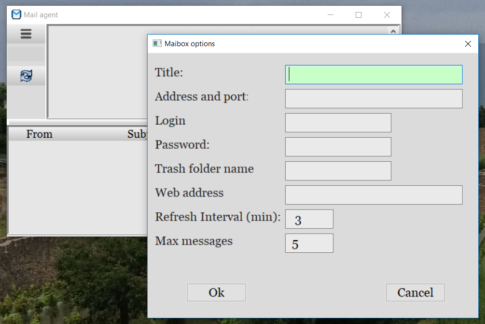

# MailAgent

The program checks a mail from a number of mailboxes at specified intervals.
It signals when new messages arrives, shows a specified number of last messages, allows to delete some of them.

The Mailagent is written in Golang and have the following dependencies:

 1) go-imap, go-imap/client packages to implement access to the imap mail server: https://godoc.org/github.com/emersion/go-imap
 2) external, a GUI framework, https://github.com/alkresin/external

 You need also a GuiServer executable, which is necessary for the External, see https://github.com/alkresin/guiserver

 Ready binary package for Windows with the GuiServer included may be downloaded from http://www.kresin.ru/en/guisrv.html

  

### Adding a mailbox
To add a mailbox to the list you need to click on the menu button in a left upper corner and to select the 'Add mailbox' menu item.
Then input the following items in a dialog box:

 - Title - the title of a mailbox - it will be displayed in the list;
 - Address and port   - the address and port number of the mail server. Have in mind, that we use imap protocol, so, for gmail, for example, it should be imap.gmail.com:993
 - Login              - the login name for a mailbox;
 - Password           - the password for a mailbox. You may do not input it here for to not keep it in agent.ini. In this case you will be asked about password every time at a program start;
 - Trash folder name  - a name of a mailbox folder, where deleted messages should be copied. If it is not set, messages won't be copied before deleting;
 - Web address        - a web address of your mailbox. It will be opened in a browser if you double click on the mailbox in a list;
 - Refresh interval (min) - a time interval in minutes to refresh the mailbox information;
 - Max messages       - a number of last messages in the mailbox, which will be displayed in a messages list.

--------------------
Alexander S.Kresin
http://www.kresin.ru/
mailto: alkresin@yahoo.com
